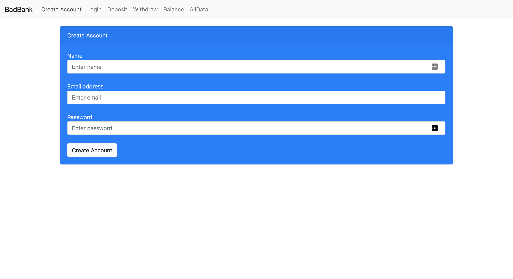

# Bank React

## Description
This project is a bank application that builds a front end in React and a back end using MongoDB.

## Installation Guidelines
- Clone the repository
- Run `npm install` in the console from the same directory as the project
- Run `node index.js`
- open `http://localhost:3000/#/` in the browser

## Technology Used
This project uses React for the front end. The server (index.js) uses express to create routs. The backend is implemented with MongoDB.

## Features
This app allow the user to create an account with a balance of $100 dolars and then make deposits and withdrawals to and from the account. The account is stored in a database.

## License
Copyright (c) 2021 Guillermo Aldaz

Permission is hereby granted, free of charge, to any person obtaining a copy of this software and associated documentation files (the "Software"), to deal in the Software without restriction, including without limitation the rights to use, copy, modify, merge, publish, distribute, sublicense, and/or sell copies of the Software, and to permit persons to whom the Software is furnished to do so, subject to the following conditions:

The above copyright notice and this permission notice shall be included in all copies or substantial portions of the Software.

THE SOFTWARE IS PROVIDED "AS IS", WITHOUT WARRANTY OF ANY KIND, EXPRESS OR IMPLIED, INCLUDING BUT NOT LIMITED TO THE WARRANTIES OF MERCHANTABILITY, FITNESS FOR A PARTICULAR PURPOSE AND NONINFRINGEMENT. IN NO EVENT SHALL THE AUTHORS OR COPYRIGHT HOLDERS BE LIABLE FOR ANY CLAIM, DAMAGES OR OTHER LIABILITY, WHETHER IN AN ACTION OF CONTRACT, TORT OR OTHERWISE, ARISING FROM, OUT OF OR IN CONNECTION WITH THE SOFTWARE OR THE USE OR OTHER DEALINGS IN THE SOFTWARE.
